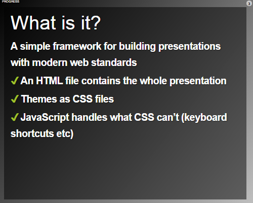

# CSSS - Slide Show (S9) Template Pack

## Live Preview



See [`slides.html`](http://slideshow-templates.github.io/slideshow-csss/slides.html).

## What's Slide Show (S9)?

A Ruby gem that lets you create slide shows and author slides in plain text
using a wiki-style markup language that's easy-to-write and easy-to-read.
More [Slide Show (S9) Project Site &raquo;](http://slideshow-s9.github.io)


## Intro

The [CSSS](https://github.com/LeaVerou/CSSS) package by Lea Verou bundled up into
a Slide Show (S9) template pack that lets you author your slides
in a wiki-style markup language (that is, Markdown or Textile) plus
lets you use text filters and helpers for adding comments, macros,
includes, syntax highlighters and much more.

Note, the CSSS package is configured to use the following headers in `slides.html.erb`:

    author: Your Name Here
    title: Your Slide Show Title Here


## Try It Yourself - How To Use the CSSS Template Pack

If you want to try it yourself, install (fetch) the new template pack. Issue the command:

    $ slideshow install csss

Or as an alternative clone the template pack using `git`. Issue the commands:

    $ cd ~/.slideshow/templates
    $ git clone https://github.com/slideshow-templates/slideshow-csss.git

To check if the new template got installed, use the `list` command:

    $ slideshow list

Listing something like:

    Installed templates include:
       csss (~/.slideshow/templates/csss/csss.txt)

Tip: To get started use the included quick starter sample. Issue the command:

    $ slideshow new -t csss

Now you will have a copy of the CSSS Quick Starter sample
(that is, [`csss.text`](https://raw.github.com/slideshow-templates/slideshow-csss/master/sample.md))
in Markdown in your working folder.

```
title: CSSS: Introduction
author: Lea Verou


## What is it?

A simple framework for building presentations with modern web standards

- An HTML file contains the whole presentation
- Themes as CSS files
- JavaScript handles what CSS can't (keyboard shortcuts etc)


## History

- I had to create a presentation for my talk at [Front Trends 2010](http://front-trends.com)
- The only web-based presentation systems I knew of didn't fit my needs
- ...so I rolled up my own
- FT2010 attendees asked me to release it
- and here it is! ;-)


## Feature: Timer

- Timer in the form of a progress bar on the top
- Define the talk duration with the attribute `data-duration` on the `body`
- Style the timer and the end state with the selectors `#timer` and `#timer.end` respectively.


## More Features

- IDs are dynamically assigned by JavaScript...
- ...but you can also assign your own, bringing the best of both worlds
- Incremental display of slide contents (just add `class="delayed"`)
- Slide scaling based on window size (size everything you want to be scalable in ems)
- Document.title changing according to slide title (fetched either from the `title`
  attribute or the slide's heading)
```

Showtime! Let's use the `-t/--template` switch to build the
sample slide show. Example:

    $ slideshow build csss.text -t csss

Open up the generated `csss.html` page in your browser. Voila. That's it.

## Questions? Comments?

Questions? Comments?
Send them along to the [wwwmake forum/mailing list](http://groups.google.com/group/wwwmake).
Thanks!
